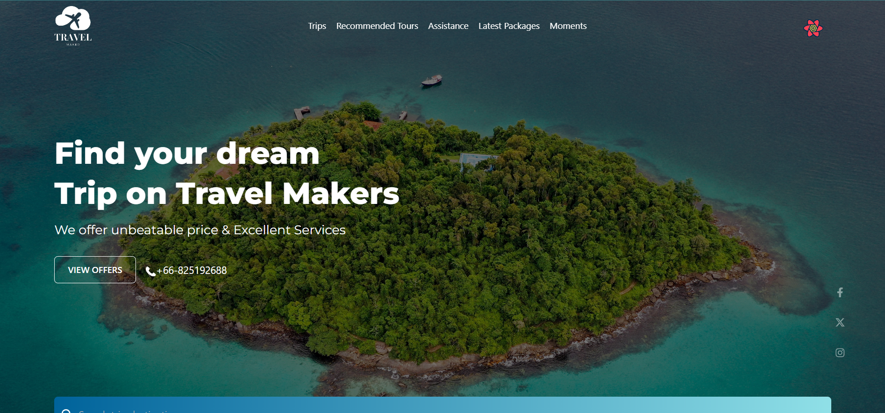

## Full-Stack Travel Makers website 

## Backend Link
[backend](https://github.com/DigitalGenius-ui/travel-maker-server)

## Features

- Display Tours
- Create Tours
- Book a Tour
- Checkout using Strip
- Leave Reviews
- Make Profile
- Share Moment
- Like moment and leave comment

## Description

Transformed a design template into a dynamic website, leveraging React JS, 
TailwindCSS, Chakra UI, and Swiper slider for an engaging front-end. Executed a robust
back-end with Express JS, Prisma, MongoDB, JWT, and Stripe, creating a seamless MERN
Authentication system. Users can explore and book tours, complete secure credit card
transactions, share travel experiences, and build profiles with a refined authentication
structure. Travel Makers offers ticket sales for both adults and children, with automated
email ticketing and admin functionalities for tour, user, comment, and ticket management.

Developed By Milad Amiri 2024.
Watch more videos from me [Milad Tech](https://www.youtube.com/@miladtech)

## Technologies 

- [React JS](https://reactjs.org/docs/getting-started.html)
- [Tailwind css](https://tailwindcss.com/)
- [React Icons](https://react-icons.github.io/react-icons/)
- [Swiper Sliderl](https://swiperjs.com/swiper-api#thumbs)
- [Express JS](https://expressjs.com/)
- [jwt](https://jwt.io/)
